## Part 1. Готовый докер

1) Взяла официальный докер-образ с nginx и скачала его при помощи docker pull<br>
    - ```docker pull nginx```<br>
    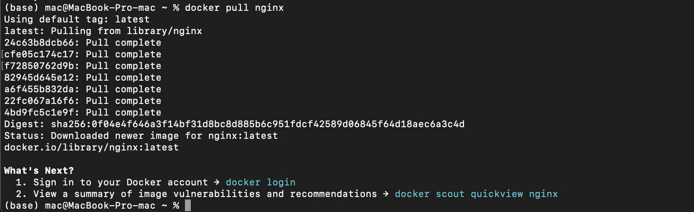


2) Проверка наличия докер-образа через <br>```docker images```<br>
    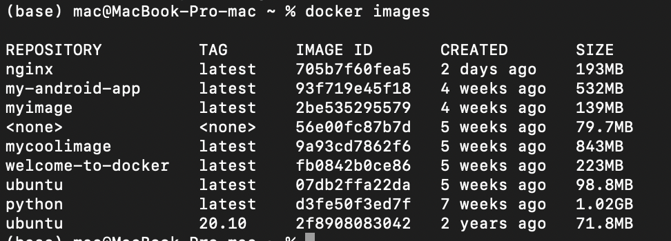

3) Запуск докер-образ через docker run -d [image_id|repository].<br> 

    - ```docker run -d nginx```<br>
    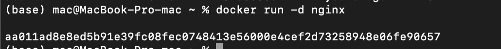<br>

4) Провека, что образ запустился через <br>```docker ps```<br>
    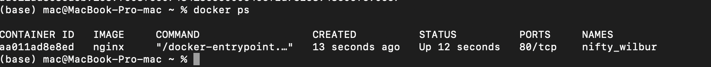<br>

5) Посмотрела информацию о контейнере через docker inspect [container_id|container_name]. По выводу команды определила размер контейнера, список замапленных портов и ip контейнера.<br> 
    - ```размер контейнера``<br>
        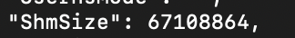<br>
    <br> 
    - ```список замапленных портов``<br>
        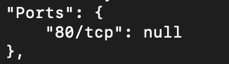<br>
     <br> 
    - ```ip контейнера``<br>
        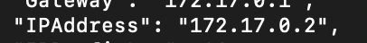<br>

6) Остановила докер образ через <br>```docker stop [container_id|container_name]```<br> 
    - ```docker stop aa011ad8e8ed```<br>
    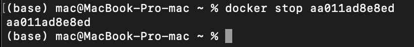<br>

7) Проверка, что образ остановился через docker ps
    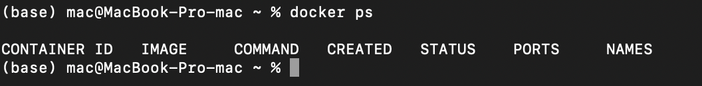<br>

8) Запуск докер с портами 80 и 443 в контейнере, замапленными на такие же порты на локальной машине, через команду run.
    - ```docker run -d -p 80:80 -p 443:443 nginx```<br>
    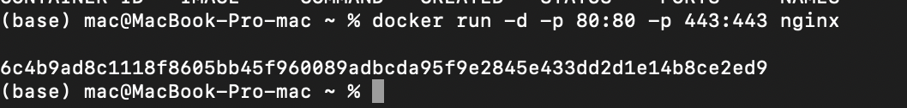<br>

9) Проверка, что в браузере по адресу localhost:80 доступна стартовая страница nginx.
    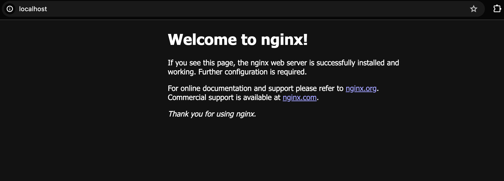<br>

10) Перезапуск докер контейнера
    - ```docker restart```<br>
    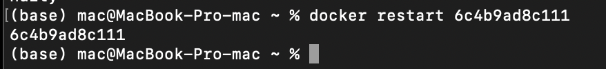<br>

11) Проверка, что контенер запустился
    - ```docker ps```<br>
    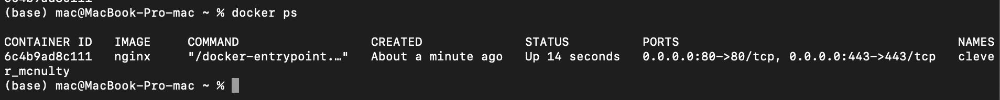<br>

## Part 2. Операции с контейнером

1) Чтение файла nginx.conf внутри докер контейнера через команду exec<br>
    - ```docker exec -it 6c4b9ad8c111 cat /etc/nginx/nginx.conf```<br>
    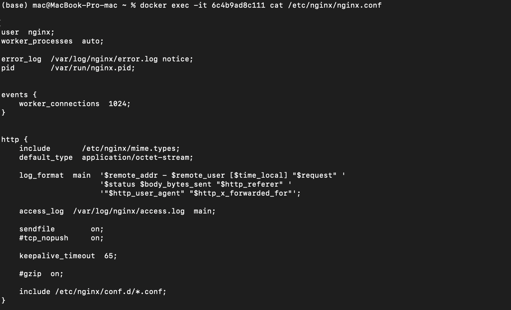

2) Создание на локальной машине файла nginx.conf и настройка в нем по пути /status отдачи страницы статуса сервера nginx.
    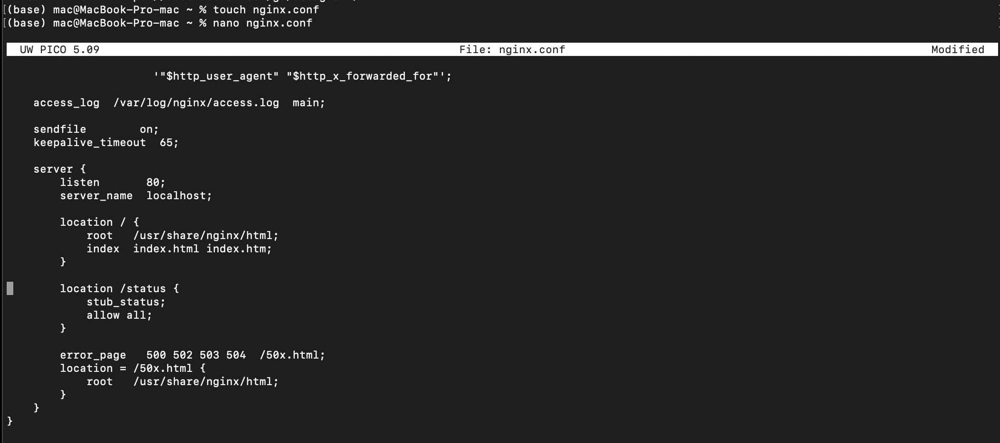

3) Копирование файла nginx.conf внутрь докер-образ.<br> 
    - ```docker cp nginx.conf 6c4b9ad8c111:/etc/nginx/nginx.conf```<br>
    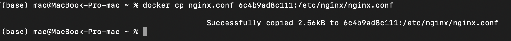<br>

4) Перезапуск nginx внутри докер-образа.
    - ```docker exec -it 6c4b9ad8c111 nginx -s reload```<br>
    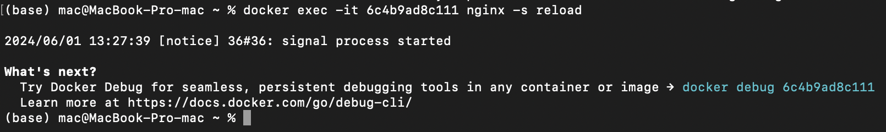<br>

5) По адресу localhost:80/status отдается страничка со статусом сервера nginx.
    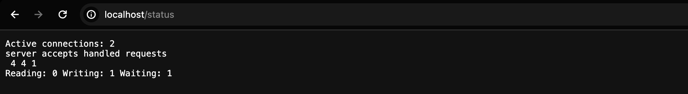<br>

6) Экспорт контейнера в файл container.tar.
    - ```docker export 6c4b9ad8c111 -o container.tar```<br>
    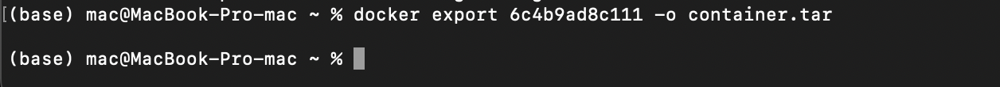<br>

7) Остановка контейнера.
    
    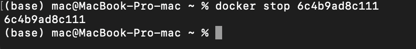<br>

8) Удаление образа.
    - ```docker rmi```<br>
    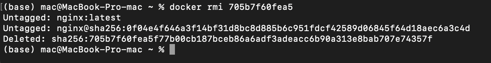<br>

9) Удаление остановленного контейнера.
    
    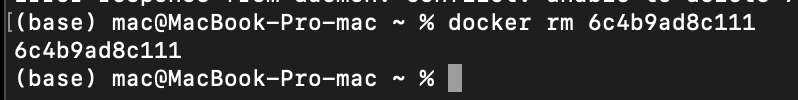<br>

10) Импорт контейнера.
    - ```docker import container.tar my-nginx-image```<br>
    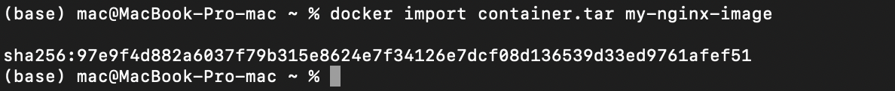<br>

11) Запуск импортированного контейнера.
    - ```docker run -d -p 80:80 -p 443:443 my-nginx-image nginx```<br>
    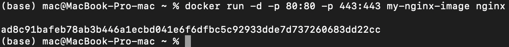<br>

12) По адресу localhost:80/status отдается страничка со статусом сервера nginx.
    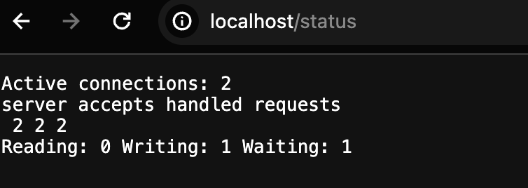<br>

## Part 3. Операции с контейнером

1) Мини-сервер на C и FastCgi, который будет возвращать простейшую страничку с надписью Hello World!. Файл с исходным кодом лежит в папке server.
    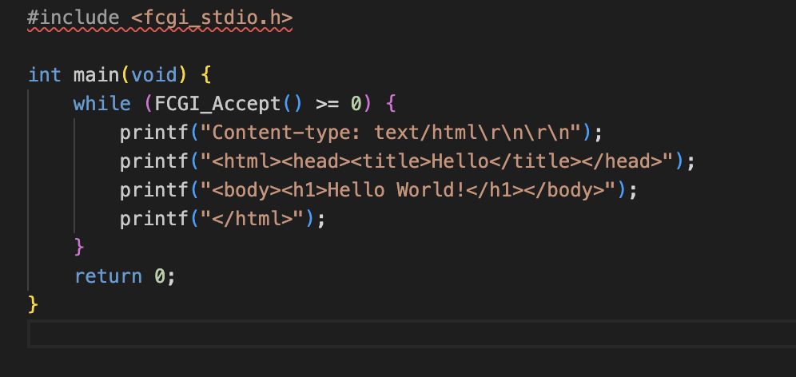

2) Запуск мини-сервера через spawn-fcgi на порту 8080.
    - ```Сначала компилируем программу через gcc```<br>
    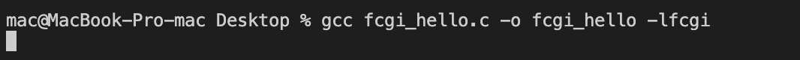<br>
    - ```Затем запускаем серевер через spawn```<br>
    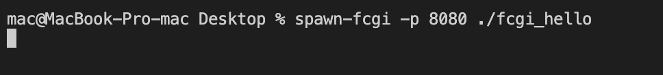<br>

3) nginx.conf, который будет проксировать все запросы с 81 порта на 127.0.0.1:8080.<br> 
    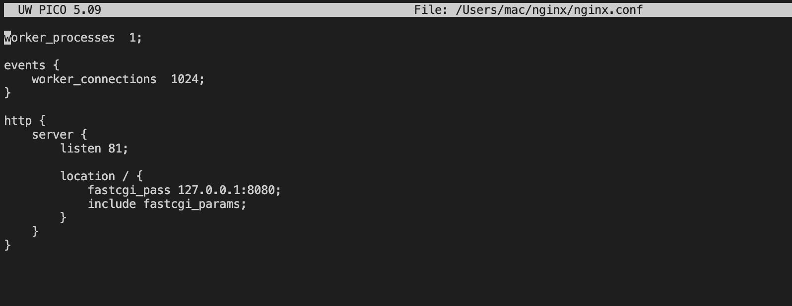<br>

4) Проверка, что в браузере по localhost:81 отдается написанная страничка.
    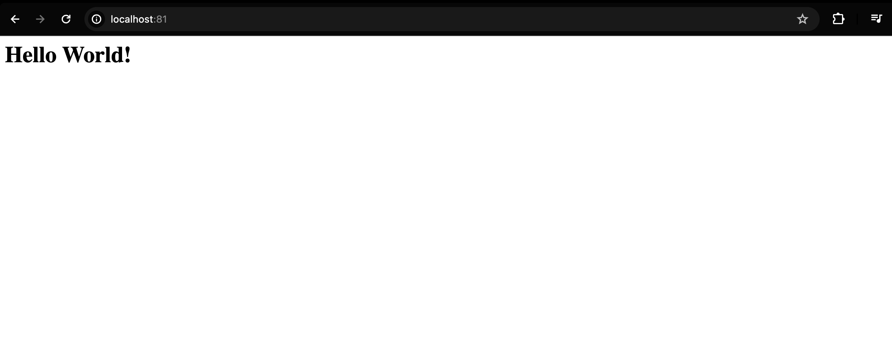<br>

5) Перенос nginx.conf по пути ./nginx/nginx.conf.
    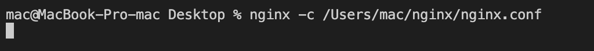<br>

## Part 4. Свой докер

1) Написала свой докер-образ, который:

    1) собирает исходники мини сервера на FastCgi из Части 3;

    2) запускает его на 8080 порту;

    3) копирует внутрь образа написанный ./nginx/nginx.conf;

    4) запускает nginx.
Он лежит в папке part4.

2) Сборка написанного докер-образа.
    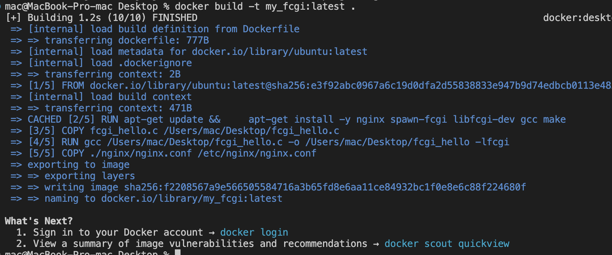

3) Проверка через docker images, что все собралось корректно.
    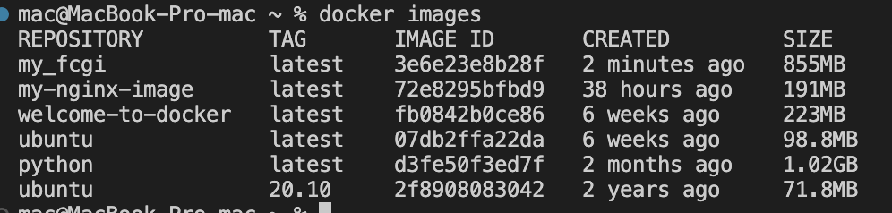<br>

4) Запуск докер-образа с маппингом 81 порта на 80 на локальной машине и маппингом папки ./nginx внутрь контейнера по адресу, где лежат конфигурационные файлы nginx'а.
    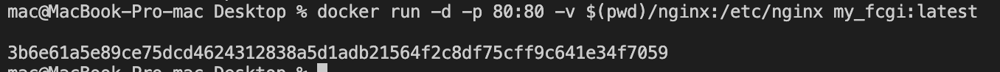<br>

5) По localhost:80 доступна страничка написанного мини сервера.
    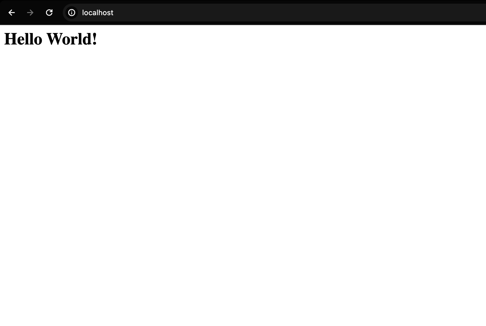<br>

6) В ./nginx/nginx.conf было дописано проксирование странички /status (он лежит в папке part4), и после перезапуска образа по localhost:80/status отдается страничка со статусом nginx.
    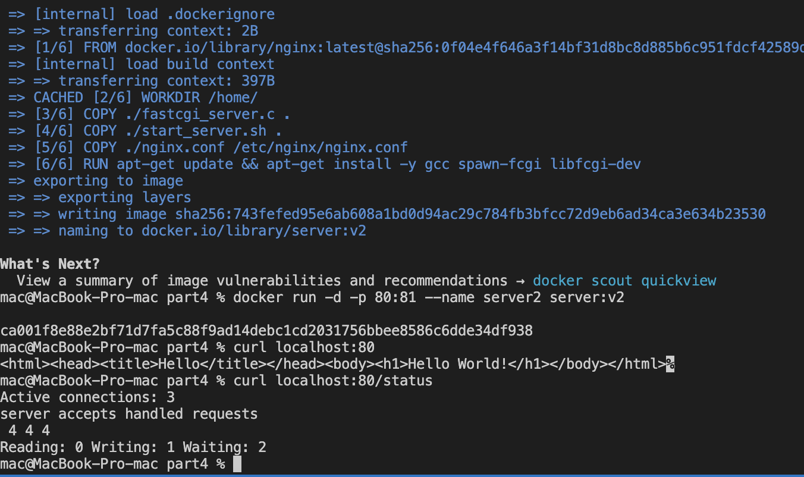<br>

## Part 5. Dockle

Образ был просканирован, ошибки исправлены, также для упрощения запуска был написан файл launch_part5.sh. Он автоматически собирает образ и проверяет его через dockle. Достаточно его запустить:
    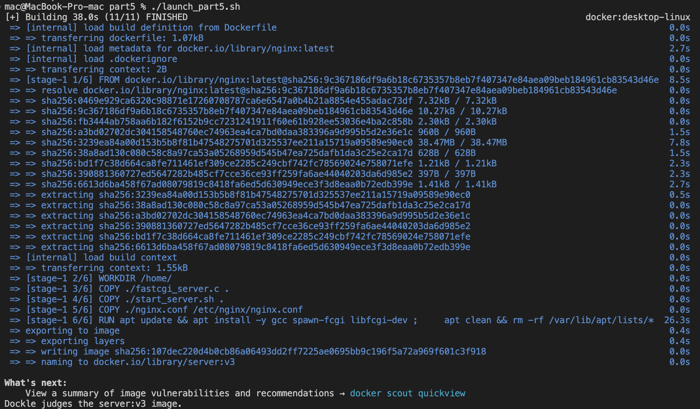<br>

## Part 6. Docker Compose

1) Был написан файл docker-compose.yml, с помощью которого:

    1) Поднимается докер-контейнер из Части 5.
    2) Поднимается докер-контейнер с nginx, который проксирует все запросы с 8080 порта на 81 порт первого контейнера.

Он лежит в папке part6.

2) Замапила 8080 порт второго контейнера на 80 порт локальной машины.
    
    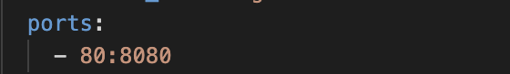<br>

3) Остановила все запущенные контейнеры.
    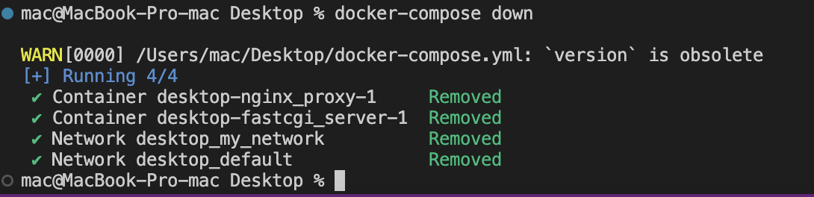<br>

4) Соберка и запуск проекта.
    - ```docker-compose build```<br>
    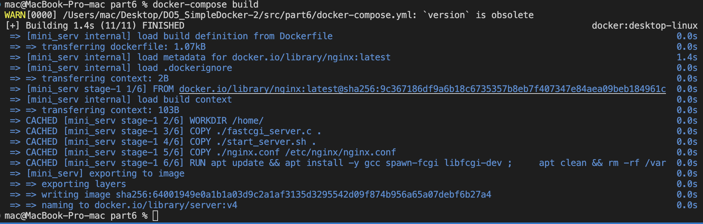<br>
    - ```docker-compose up```<br>
    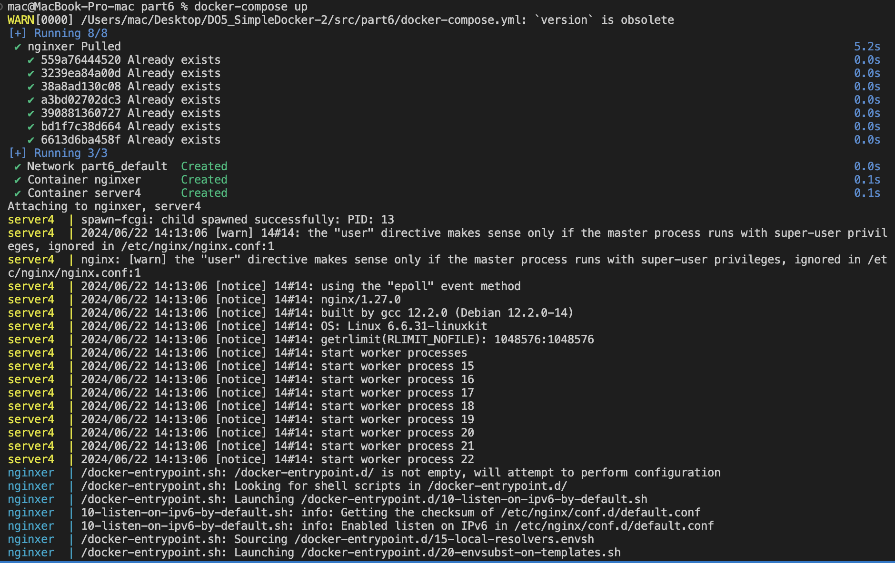<br>

5) В браузере по localhost:80 отдается написанная страничка, как и ранее.
    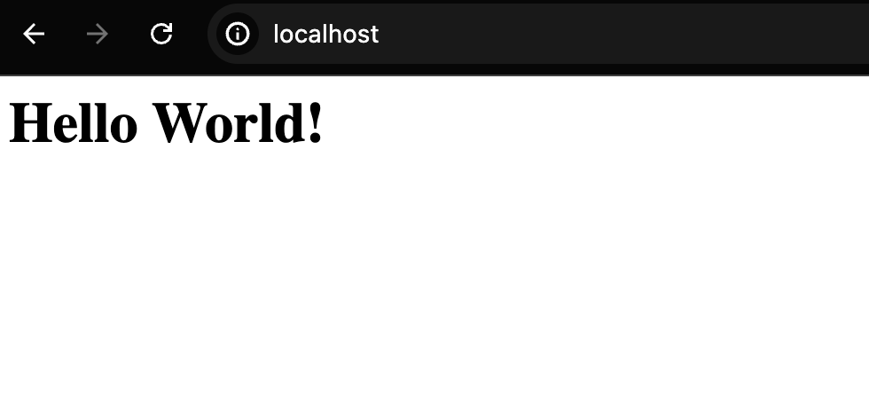<br>